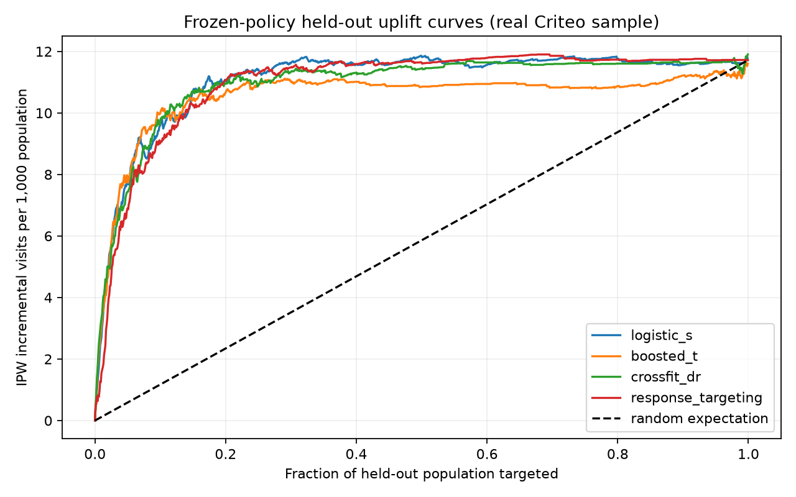
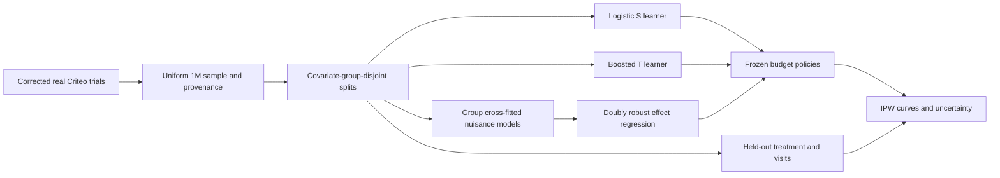

# LiftLab — Incrementality and Budgeted Targeting

LiftLab asks a practical product-data question: **who benefits from an intervention, rather than merely who is likely to respond?** It trains treatment-effect models on real, corrected Criteo randomized-trial data and audits targeting policies on a frozen, covariate-group-disjoint test set.

The benchmark's outcome is **a visit**, not a purchase, revenue, or observed business savings. Its central result is that complexity is not automatically better: the logistic S-learner has a slightly larger test Qini area than the boosted T-learner and cross-fitted doubly robust learner; ordinary response targeting is competitive. This is a one-million-row research benchmark, not a deployed advertising system.



## Technical snapshot

| Question | Implementation |
|---|---|
| What is trained here? | Logistic S-learner with treatment interactions, LightGBM T-learner, two-fold cross-fitted doubly robust learner |
| Dataset | Corrected Criteo uplift v2.1: 13,979,592 source records; uniform one-million-row sample |
| Inputs | Twelve anonymized pre-treatment covariates; treatment assignment used in fitting, never exposure/outcome leakage |
| Baselines | Logistic effect model, ordinary treated-response targeting, analytical random-targeting expectation |
| Evaluation | IPW uplift curves, AUUC, centered Qini area, 10/20/30% budget policies, 200-pairs-bootstrap intervals, effect bins |
| Not demonstrated | Individual counterfactual accuracy, revenue uplift, live deployment, temporal/cross-advertiser generalization |

## System flow

```text
corrected real Criteo file -> full-file seeded uniform priority sample
  -> identical-covariate group hashes -> train / development / frozen test
  -> logistic S and boosted T learners + group-cross-fitted DR learner
  -> pre-treatment scores -> fixed-budget targeting masks
  -> held-out IPW curves, calibration bins, bootstrap intervals
```

## Architecture



### Pre-processing

The original 25-million-row dataset has an advertiser-leakage erratum. Only the corrected **v2.1** file is accepted; the loader checks its 13,979,592-row count and records SHA-256. Uniform random priorities are generated across the entire file, so the one-million-row sample is not a convenient prefix. Original float64 covariates are hashed before float32 model conversion; exact duplicate covariates stay in one partition. There are 11,121 duplicate-covariate rows in this sample. Hashes are grouping keys, not recovered customer identifiers.

### Learned effects

The logistic S-learner uses standardized covariates, treatment and covariate-treatment interactions. The T-learner fits separate visit models to control and treated examples. The DR learner fits two group-disjoint out-of-fold nuisance-model pairs, forms doubly robust pseudo-outcomes using only other-fold nuisance estimates, and trains a final boosted regressor. Hyperparameters are fixed before evaluation, not selected on the test set. Development results are diagnostic rather than a hidden tuning loop.

### Evaluation and inference

For observed visit `y`, assignment `t`, and training-estimated propensity `p`, the IPW evaluation outcome is `y * (t/p - (1-t)/(1-p))`. Cumulative gains divide by the whole evaluation population; Qini area subtracts the random-policy line. Budget results mean incremental **visits per 1,000 people in the whole evaluation population**, not per 1,000 targeted users. Per-bin mean predictions and IPW effects are included for diagnostic calibration, not individual-effect ground truth.

The 200 pairs-bootstrap intervals condition on the fitted model, frozen test-budget mask and training propensity. They do not capture retraining variation, hidden dependence between customers, or provide simultaneous/paired superiority tests. All policy families are reported; no test winner is selected for deployment.

## What works today

- Real corrected-dataset download, complete-file sampling, group-safe partitions and provenance.
- Three trained effect estimators and a response-targeting baseline.
- Frozen-test targeting curves, budget estimates, bootstrap intervals and effect-bin diagnostics.
- Saved local models and a CSV inference command using pre-treatment covariates only.
- Contract tests and CI; synthetic fixtures are confined to unit tests, not results.

## Measured results, with context

The executed sample uses **700,560 train / 149,715 development / 149,725 test rows**, seed 42. The training treatment proportion is 0.850501. Models were trained on CPU with two threads. Full unrounded results and provenance are in [`outputs/evaluation.json`](outputs/evaluation.json) and [`outputs/provenance.json`](outputs/provenance.json).

| Frozen test policy | Qini area | Incremental visits / 1,000 population at 20% budget | Conditional bootstrap 95% interval |
|---|---:|---:|---:|
| Logistic S | 0.005184 | 11.07 | [8.39, 13.56] |
| Boosted T | 0.004663 | 10.66 | [8.07, 13.03] |
| Cross-fitted DR | 0.005062 | 10.96 | [8.60, 12.91] |
| Ordinary response targeting | 0.005090 | 11.06 | [8.63, 13.54] |
| Random-targeting expectation | 0 by definition | 2.34 | Not bootstrapped |

**The advanced learners do not dominate the simple model or response targeting.** The policy intervals overlap strongly; the table is not evidence of significant superiority between learned methods. The anonymized, subsampled trial benchmark does not recover Criteo's original commercial incrementality.

## Requirements

Python 3.12, approximately 1 GB for sample processing/model fitting plus package overhead, and about 1 GB of available disk for compressed source/sample/artifacts. Raw source is about 297 MB compressed. No GPU, API key or paid model required. Raw data and checkpoints are excluded from Git.

## Run on macOS or Linux

```bash
python3.12 -m venv .venv
source .venv/bin/activate
python -m pip install -r requirements.txt
# macOS only, if LightGBM reports a missing libomp:
export DYLD_LIBRARY_PATH="$PWD/.venv/lib/python3.12/site-packages/sklearn/.dylibs${DYLD_LIBRARY_PATH:+:$DYLD_LIBRARY_PATH}"
python liftlab.py prepare --rows 1000000
python liftlab.py run
python -m pytest -q
```

The macOS workaround uses the OpenMP runtime already installed with scikit-learn; alternatively install a compatible system OpenMP runtime. Linux CI uses the normal packaged environment. Training artifacts are local; do not load untrusted joblib files.

## Score your own compatible covariates

```bash
python liftlab.py predict --input data/your_features.csv --output data/scores.csv
```

CSV inputs must contain `f0` through `f11` on the Criteo feature representation. Anonymized features are not a generic customer schema: scoring arbitrary business columns as these features is invalid. The CLI is for compatible benchmark inputs and reproducibility, not out-of-domain deployment.

## Validate the installation

```bash
python -m pytest -q
```

Six initial contract tests cover duplicate-group isolation, order-independent splitting, IPW algebra, null-effect curves, treatment interactions and invalid propensities. CI does not download the external dataset.

## Limitations and next experiments

- One sampled training set, one seed and fixed hyperparameters; this is not full 13.98M training.
- No temporal or advertiser identifiers to support those generalization claims.
- Anonymization/subsampling prevents claims about original business incrementality.
- Visits are the declared outcome; conversion and exposure fields are excluded from model inputs.
- Conditional test bootstrap does not cover training variability or unidentified record dependence.
- Next: multi-seed training, paired policy-difference intervals, conversion-outcome sensitivity, and full-dataset scaling with a fresh evaluation contract.

## Sources and licences

- [Criteo official dataset, erratum and terms](https://ailab.criteo.com/criteo-uplift-prediction-dataset/).
- [Criteo-owned corrected v2.1 distribution](https://huggingface.co/datasets/criteo/criteo-uplift).
- [Original authors' benchmark paper](https://arxiv.org/abs/2111.10106).
- [LightGBM documentation](https://lightgbm.readthedocs.io/en/stable/).

Repository code is MIT licensed. The dataset is **CC BY-NC-SA 4.0**, separately licensed, and not redistributed. The published aggregate benchmark outputs are offered under CC BY-NC-SA 4.0 to preserve the source's conditions; they are not customer-level data. Source attribution: Eustache Diemert, Artem Betlei, Christophe Renaudin and Massih-Reza Amini, *A Large Scale Benchmark for Uplift Modeling* (2018); corrected data and follow-up benchmark are linked above.
