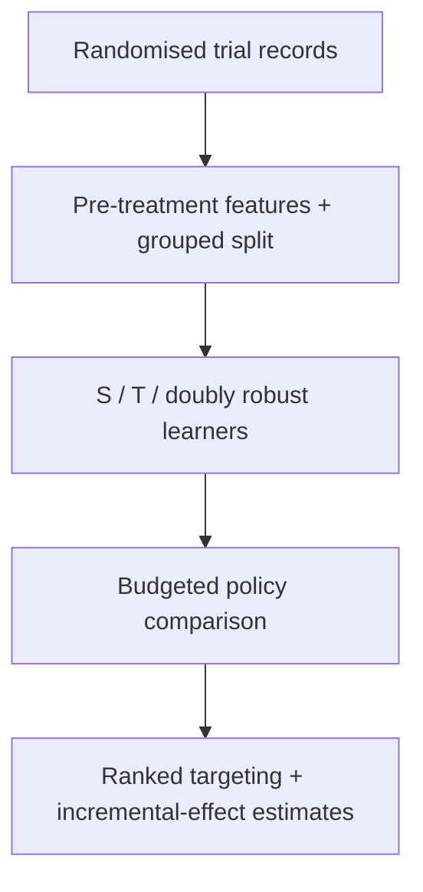

# LiftLab

Project report | Harsh Saand | 22 September 2026

## The problem

An individual likely to visit after an advertisement may have visited anyway. LiftLab estimates treatment-driven lift and compares budget-limited targeting policies on a randomised advertising dataset.

## What a user gets

The output is a ranked policy and a budgeted targeting decision, with estimated incremental visits and uncertainty.

## Practical value

This helps distinguish response prediction from causal targeting. The recorded estimates do not show consistent superiority for complex learners, and they do not measure a new advertising campaign or revenue gain.

## Logic and flow



<details>
<summary><strong>Dataset at a glance</strong></summary>

The corrected **Criteo uplift v2.1** release has **13,979,592 records** from a randomized advertising experiment. One row combines **12 anonymized pre-treatment covariates**, treatment assignment and observed outcomes; the project evaluates incremental visits, not an individual's unobserved counterfactual or revenue. Post-treatment exposure/outcome fields are not used as prediction features.

A uniform **one-million-row sample** is partitioned into **700,560 training / 149,715 development / 149,725 test rows** with seed 42. These are randomized row partitions, not future-time or new-advertiser tests. Raw data stays local; sample/split provenance is recorded in [`outputs/provenance.json`](https://github.com/HarshSaand/liftlab/blob/a467deeef4e5f1af435cb5e20bb3f9a8f3439acd/outputs/provenance.json).

</details>

<details>
<summary><strong>Technical snapshot</strong></summary>

| Question | Implementation |
|---|---|
| What is trained here? | Logistic S-learner with treatment interactions, LightGBM T-learner, two-fold cross-fitted doubly robust learner |
| Dataset | Corrected Criteo uplift v2.1: 13,979,592 source records; uniform one-million-row sample |
| Inputs | Twelve anonymized pre-treatment covariates; treatment assignment used in fitting, never exposure/outcome leakage |
| Baselines | Logistic effect model, ordinary treated-response targeting, analytical random-targeting expectation |
| Evaluation | IPW uplift curves, AUUC, centered Qini area, 10/20/30% budget policies, 200-pairs-bootstrap intervals, effect bins |
| Not demonstrated | Individual counterfactual accuracy, revenue uplift, live deployment, temporal/cross-advertiser generalization |

</details>

<details>
<summary><strong>Architecture</strong></summary>

### Pre-processing

The original 25-million-row dataset has an advertiser-leakage erratum. Only the corrected **v2.1** file is accepted; the loader checks its 13,979,592-row count and records SHA-256. Uniform random priorities are generated across the entire file, so the one-million-row sample is not a convenient prefix. Original float64 covariates are hashed before float32 model conversion; exact duplicate covariates stay in one partition. There are 11,121 duplicate-covariate rows in this sample. Hashes are grouping keys, not recovered customer identifiers.

### Learned effects

The logistic S-learner uses standardized covariates, treatment and covariate-treatment interactions. The T-learner fits separate visit models to control and treated examples. The DR learner fits two group-disjoint out-of-fold nuisance-model pairs, forms doubly robust pseudo-outcomes using only other-fold nuisance estimates, and trains a final boosted regressor. Hyperparameters are fixed before evaluation, not selected on the test set. Development results are diagnostic rather than a hidden tuning loop.

### Evaluation and inference

For observed visit `y`, assignment `t`, and training-estimated propensity `p`, the IPW evaluation outcome is `y * (t/p - (1-t)/(1-p))`. Cumulative gains divide by the whole evaluation population; Qini area subtracts the random-policy line. Budget results mean incremental **visits per 1,000 people in the whole evaluation population**, not per 1,000 targeted users. Per-bin mean effect predictions and IPW effects are included for diagnostic calibration, not individual-effect ground truth. The response-targeting baseline scores **visit probability, not treatment effect**: its separate `response_score_bins` are descriptive response-score strata, not treatment-effect calibration.

The 200 pairs-bootstrap intervals condition on the fitted model, frozen test-budget mask and training propensity. They do not capture retraining variation, hidden dependence between customers, or provide simultaneous/paired superiority tests. All policy families are reported; no test winner is selected for deployment.

</details>

<details>
<summary><strong>Measured results, with context</strong></summary>

The executed sample uses **700,560 train / 149,715 development / 149,725 test rows**, seed 42. The training treatment proportion is 0.850501. Models were trained on CPU with two threads. Full unrounded results and provenance are in [`outputs/evaluation.json`](https://github.com/HarshSaand/liftlab/blob/a467deeef4e5f1af435cb5e20bb3f9a8f3439acd/outputs/evaluation.json) and [`outputs/provenance.json`](https://github.com/HarshSaand/liftlab/blob/a467deeef4e5f1af435cb5e20bb3f9a8f3439acd/outputs/provenance.json).

| Frozen test policy | Qini area | Incremental visits / 1,000 population at 20% budget | Conditional bootstrap 95% interval |
|---|---:|---:|---:|
| Logistic S | 0.005184 | 11.07 | [8.39, 13.56] |
| Boosted T | 0.004663 | 10.66 | [8.07, 13.03] |
| Cross-fitted DR | 0.005062 | 10.96 | [8.60, 12.91] |
| Ordinary response targeting | 0.005090 | 11.06 | [8.63, 13.54] |
| Random-targeting expectation | 0 by definition | 2.34 | Not bootstrapped |

**The advanced learners do not dominate the simple model or response targeting.** The policy intervals overlap strongly; the table is not evidence of significant superiority between learned methods. The anonymized, subsampled trial benchmark does not recover Criteo's original commercial incrementality.

</details>

<details>
<summary><strong>Limitations and next experiments</strong></summary>

- One sampled training set, one seed and fixed hyperparameters; this is not full 13.98M training.
- No temporal or advertiser identifiers to support those generalization claims.
- Anonymization/subsampling prevents claims about original business incrementality.
- Visits are the declared outcome; conversion and exposure fields are excluded from model inputs.
- Conditional test bootstrap does not cover training variability or unidentified record dependence.
- Next: multi-seed training, paired policy-difference intervals, conversion-outcome sensitivity, and full-dataset scaling with a fresh evaluation contract.

</details>

<details>
<summary><strong>Using the project</strong></summary>

```bash
python3.12 -m venv .venv
source .venv/bin/activate
python -m pip install -r requirements.txt
# macOS only, if LightGBM reports a missing libomp:
export DYLD_LIBRARY_PATH="$PWD/.venv/lib/python3.12/site-packages/sklearn/.dylibs${DYLD_LIBRARY_PATH:+:$DYLD_LIBRARY_PATH}"
python liftlab.py prepare --rows 1000000
python liftlab.py run
python -m pytest -q
```

The macOS workaround uses the OpenMP runtime already installed with scikit-learn; alternatively install a compatible system OpenMP runtime. Linux CI uses the normal packaged environment. Training artifacts are local; do not load untrusted joblib files.

</details>

## Evidence and reproduction references

Source revision: a467deeef4e5f1af435cb5e20bb3f9a8f3439acd

- [README.md](https://github.com/HarshSaand/liftlab/blob/a467deeef4e5f1af435cb5e20bb3f9a8f3439acd/README.md)
- [docs/output-example.json](https://github.com/HarshSaand/liftlab/blob/a467deeef4e5f1af435cb5e20bb3f9a8f3439acd/docs/output-example.json)
- [outputs/evaluation.json](https://github.com/HarshSaand/liftlab/blob/a467deeef4e5f1af435cb5e20bb3f9a8f3439acd/outputs/evaluation.json)

This report describes the source and saved evidence at the revision above. Training and full benchmark runs were not repeated for this documentation release. Dataset, model and dependency licences remain separate from the project documentation.
